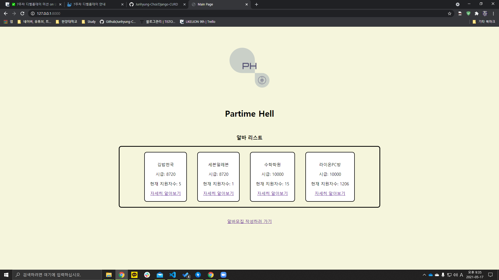

# 멋쟁이 사자처럼 7주차 디벨롭데이

- [x] DB에 지금 알바를 구하는 가게들의 **리스트, 기업들의 구인지역, 알바 상세정보, 장소, 시급, 하는 일, 현재 지원자 수 등의 정보**를 넣는다.
- [x] 메인페이지에 알바를 구하는 가게들의 리스트가 나오고 리스트를 클릭하면, **가게와 관련한 세부 정보**들이 나온다.
- [x] 알바를 지원할 수 있는 버튼을 만들어서 **버튼을 누르면, 현재 지원한 지원자 수가 변동**된다
마찬가지로 지원을 취소하면 현재 지원한 지원자 수가 변동되게 해주세요
- [x] 메인 페이지에 사장님들이 자신의 가게 알바를 구하기 위해 글을 올릴 수 있게 한다
(원래대로면, 로그인 기능을 이용해서, 알바와 사장님을 구분하여 글 생성 권한을 다르게 해야하지만, 아직 로그인 기능을 배우지 않았으므로, **로그인 기능 없이 모든 사용자가 글을 생성할 수 있게 해주세요!**)-알바를 구하는 가게 리스트에 Create되게끔!
- [x] 가게의 정보를 **수정(Update)** 하거나, **삭제(Delete)** 하는 기능을 넣는다

## Main 화면

## Detail 화면

